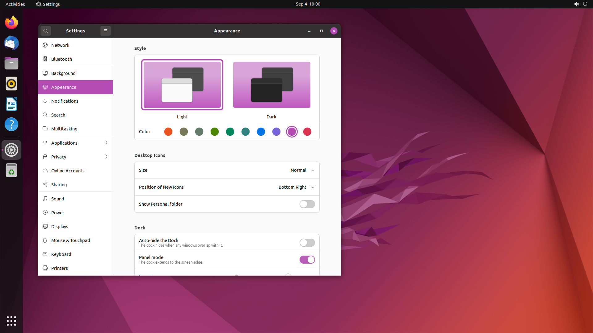

# Yaru Classic theme

This is a fork of [Yaru] to keep the original dark headerbar theme that was
removed upstream in 21.10.1.

## Known issues

Understand that upstream removed the mixed theme [because it caused problems
that could not be fixed][upstream-issue-2918], and thus that these problems are
still present in this version.  If you love the distinctive contrast of the
theme as much as I do, you will have to overlook those.

## Installing

Yaru Classic is available in the [NUR] under `repos.lourkeur.yaru-classic`.
Debian packages are available in the [GitHub releases].

[Yaru]: https://github.com/ubuntu/yaru
[upstream-issue-2918]: https://github.com/ubuntu/yaru/issues/2918
[NUR]: https://github.com/nix-community/NUR
[GitHub releases]: https://github.com/lourkeur/yaru-classic/releases
